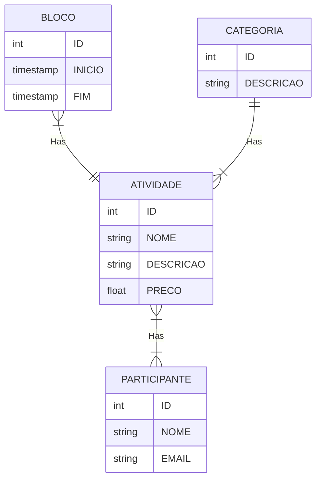

# desafio02
Criar um projeto no Spring Boot com Java e banco de dados H2, e implementar o modelo conceitual conforme especificação a seguir.

```mermaid
erDiagram
    ATIVIDADE {
        int ID
        string NOME
        string DESCRICAO
        float PRECO
    }
    CATEGORIA {
        int ID
        string DESCRICAO
    }
    BLOCO {
        int ID
        timestamp INICIO
        timestamp FIM
    }
    PARTICIPANTE {
        int ID
        string NOME
        string EMAIL
    }
    BLOCO }|--|| ATIVIDADE : "Has"
    CATEGORIA ||--|{ ATIVIDADE : "Has"
    ATIVIDADE }|--|{ PARTICIPANTE : "Has"
```
